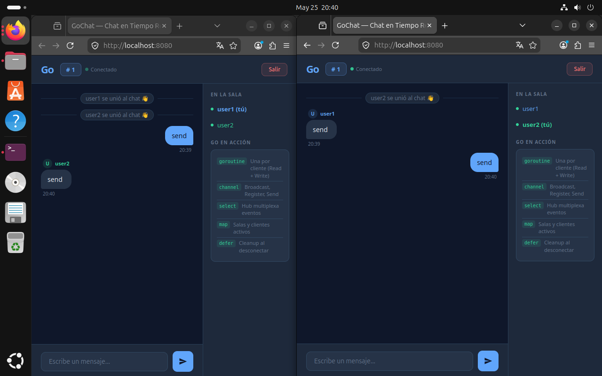

# Realtime WebSocket Chat

A real-time chat application built with Go and WebSockets, designed to demonstrate backend communication, concurrency, and real-time messaging concepts.

## Features

- Real-time communication using WebSockets
- Multiple client support
- Lightweight backend architecture
- Modular Go project structure
- Simple web interface
- Concurrent client handling

## Technologies

- Go (Golang)
- WebSockets
- HTML/CSS
- JavaScript

## Project Structure

```bash
cmd/            # Application entry point
internal/       # Internal application logic
handlers/       # WebSocket handlers
hub/            # Client and message management
models/         # Data models
static/         # Frontend files
```

## Installation

Clone the repository:

```bash
git clone https://github.com/YOUR_USERNAME/realtime-websocket-chat.git
```

Navigate to the project:

```bash
cd realtime-websocket-chat
```

Run the application:

```bash
go run ./cmd
```

Open in browser:

```bash
http://localhost:8080
```

## Screenshot



## Learning Objectives

This project was developed to practice:

- Real-time networking
- WebSocket communication
- Backend architecture in Go
- Concurrent client handling
- Full-stack integration concepts

## Disclaimer

This project was created for educational purposes.